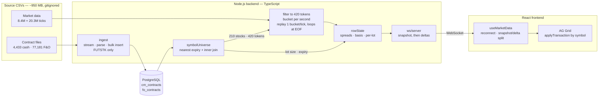
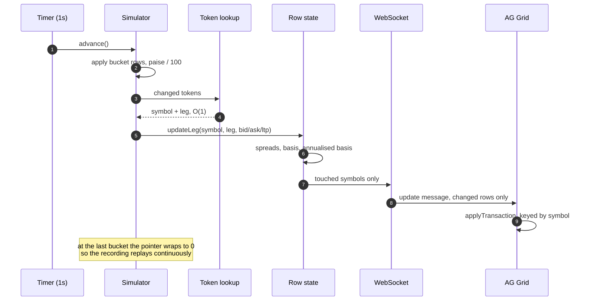
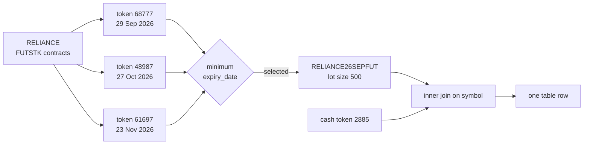

# Cash–Future Table

[](https://github.com/rmnvg/nse-cash-future-table/actions/workflows/ci.yml)


**A real-time NSE cash–future arbitrage table.** A Node.js/WebSocket backend
replays ~29M recorded ticks, PostgreSQL holds the contract reference data,
and a React + AG Grid frontend renders live prices, spreads and basis —
one row per stock, updating every second.


---

### Contents

- [Overview](#overview)
- [Highlights](#highlights)
- [Architecture](#architecture)
- [The tick lifecycle](#the-tick-lifecycle)
- [Picking the nearest future](#picking-the-nearest-future)
- [Beyond the brief: ranking by opportunity](#beyond-the-brief-ranking-by-opportunity)
- [Quick start](#quick-start)
- [Running it step by step](#running-it-step-by-step)
- [Tests](#tests)
- [Measured performance](#measured-performance)
- [Requirement coverage](#requirement-coverage)
- [Data quirks discovered](#data-quirks-discovered)
- [Design decisions](#design-decisions)
- [Project layout](#project-layout)
- [Known limitations](#known-limitations)

---

## Overview

For every NSE stock that has **both** a cash contract (NSECM) and a stock
futures contract (NSEFO `FUTSTK`), the table shows that stock's cash price
alongside its **nearest-expiry** future, and the two spreads between them:

| Column | Meaning |
| --- | --- |
| **Symbol** | Stock symbol |
| **Stock LTP** | Last traded price of the cash leg (NSECM) |
| **Future LTP** | Last traded price of the nearest-expiry future (NSEFO) |
| **Buy Spread** | `Future Bid − Stock Ask` |
| **Sell Spread** | `Stock Bid − Future Ask` |

210 stocks qualify. Each gets exactly one row, updated in place as ticks
arrive.

## Highlights

- **Real-time by transaction, not re-render.** Only the symbols that changed
  in a tick are broadcast, and AG Grid applies them via `applyTransaction`
  keyed by `getRowId` — a tick repaints a handful of cells, not 210 rows.
- **Ranks opportunities, not just prices.** Derives basis % and *annualised*
  basis %, so stocks at wildly different price levels become comparable.
  [See below](#beyond-the-brief-ranking-by-opportunity).
- **56 tests, no fixtures required.** Unit *and* WebSocket integration tests
  that need neither Postgres nor the 950MB of CSVs, so CI stays green.
- **Measured, not guessed.** [Real numbers](#measured-performance) for cold
  start, memory, payload size and throughput.
- **Handles the data's sharp edges.** Two different delimiters, a 1980 IST
  epoch, prices in paise, and 18 test instruments that would otherwise sit
  at the top of the table forever empty.

## Architecture



The expensive work happens once at startup: ~29M raw ticks are filtered down
to the ~3.3M belonging to the 420 tokens we care about, then grouped into
per-second buckets. After that, each tick is an O(changed tokens) map write
plus one broadcast.

## The tick lifecycle



The cash and futures legs run as two independent simulators. They cover
different time windows in the source data (~26h vs ~3h), so they loop
independently rather than being forced into lockstep.

## Picking the nearest future

A stock typically has three open futures contracts. The brief requires the
nearest expiry, resolved with `DISTINCT ON (symbol) ... ORDER BY expiry_date`:



The `INNER JOIN` is what enforces *"only stocks with both a cash contract
and a FUTSTK future"* — no separate filtering step is needed.

## Beyond the brief: ranking by opportunity

A rupee spread isn't comparable across stocks. ABB at ₹7,447 with a ₹121
spread and ADANIPOWER at ₹207 with a ₹12 spread can't be ranked against each
other — and with 210 rows, *"which one is actually worth trading?"* is the
question the table should answer.

So it also derives:

```
basis %             =  (Future LTP − Stock LTP) / Stock LTP × 100
annualised basis %  =  basis % × 365 / days to expiry
```

Annualising is what makes a 0.4% basis with 18 days left comparable with a
1.2% basis with 80 days left — it's the number a cash-and-carry desk ranks
on. Switching **Rank** to *by annualised basis* surfaces the widest
opportunities instead of whatever is alphabetically first:


Lot size comes from the NSEFO contract file (RELIANCE 500, TCS 225,
ADANIPOWER 3,550), so each spread is also shown as rupees per contract —
what a trader actually sizes on.

> **Note on which prices feed which number.** The spreads are *executable*,
> so they use the book (bid/ask). Basis describes where the future trades
> relative to spot regardless of how wide the book is, so it uses LTPs. That
> matters here: this recorded sample contains crossed quotes, which make
> bid/ask-derived figures jumpy while the LTP-based basis stays well behaved.

## Quick start

```bash
npm run install:all                     # root + backend + frontend deps
npm run db:up                           # Postgres in Docker
cp backend/.env.example backend/.env    # then set DATA_DIR
npm run setup                           # migrate + ingest contracts
npm run dev                             # backend + frontend together
```

Open <http://localhost:5173>.

`DATA_DIR` must be the absolute path to the folder holding the four NSE CSV
files. They aren't committed — they total ~950MB. The backend fails fast
naming the exact missing file if the path is wrong.

## Running it step by step

<details>
<summary><b>1 · Start PostgreSQL</b></summary>

```bash
docker compose up -d
```

Wait for `cashfuture_postgres` to report healthy in `docker ps`. Data lives
in a named volume, so it survives `docker compose down`.
</details>

<details>
<summary><b>2 · Configure the backend</b></summary>

```bash
cd backend
cp .env.example .env
```

Set `DATA_DIR`; every option is documented inline in `.env.example`,
including `EXCLUDE_TEST_SYMBOLS` and `TICK_INTERVAL_MS`.
</details>

<details>
<summary><b>3 · Load the database</b></summary>

```bash
npm run migrate            # creates cm_contracts / fo_contracts
npm run ingest:contracts   # streams both contract CSVs into Postgres
npm run verify:contracts   # counts + RELIANCE's contracts, nearest first
npm run check:universe     # the resolved cash+future stock universe
```

Both are safely re-runnable — the schema drops and recreates its tables, and
inserts use `ON CONFLICT (token) DO NOTHING`.

Expected output: **4,433** cash contracts, **647** FUTSTK futures (76,534
non-FUTSTK rows skipped), and a **210**-stock universe.
</details>

<details>
<summary><b>4 · Run the app</b></summary>

```bash
npm run dev     # from the repo root, starts both servers
```

Or separately, with `npm run dev` inside `backend/` and `frontend/`. The
frontend defaults to `ws://localhost:8080`; override with `VITE_WS_URL`
(see `frontend/.env.example`).
</details>

## Tests

```bash
npm test        # from the repo root, or inside backend/
```

**56 tests across 7 files, ~300ms.** They need neither Postgres nor the CSV
files — which is exactly what lets CI run them on every push.

| Suite | Covers |
| --- | --- |
| `parseContracts.test.ts` | Space-delimited layout, whitespace tolerance, lot size, NSE epoch → `2026-09-29T09:00Z` |
| `parseMarketData.test.ts` | Comma-delimited layout, paise, zero-bid rows |
| `bucketByTimestamp.test.ts` | Per-second grouping, ordering, empty input |
| `tokenLookup.test.ts` | Both legs routed, unknown tokens ignored |
| `rowState.test.ts` | Spread formulas, partial-leg nulls (never `NaN`), rounding, basis, annualisation, zero-spot guard, lot sizing |
| `simulator.test.ts` | Paise conversion, changed-token reporting, **loop-back wrap**, idempotent start, empty buckets |
| `server.test.ts` | **Integration** — real WebSocket server + real row state + stub simulator: snapshot on connect, nulls before first tick, deltas carry only changed symbols, fan-out to multiple clients, survives a client disconnecting mid-broadcast |

## Measured performance

Replaying the full provided dataset on an M-series MacBook:

| Metric | Value |
| --- | --- |
| Cold start to first tick | **14.0 s** |
| Cash file filter + bucket | 1,629,624 rows → 23,223 buckets in 4.0 s |
| Futures file filter + bucket | 1,667,989 rows → 10,414 buckets in 10.0 s |
| Resident memory, steady state | **436 MB** for ~3.3M buffered ticks |
| Snapshot payload (210 rows) | 75.6 KB |
| Update payload | ~21 KB, averaging 59 symbols per tick |
| WebSocket throughput | ~63 KB/s |

Startup cost is entirely the one-off parse of ~950MB of CSV. Steady-state
cost per tick is a map write per changed token plus a single broadcast.

## Requirement coverage

| Brief requirement | Where | Verified by |
| --- | --- | --- |
| React frontend, AG Grid table | `frontend/src/CashFutureTable.tsx` (Community edition) | Browser + build |
| Node.js backend, WebSocket server | `backend/src/index.ts`, `ws/server.ts` | `server.test.ts` |
| PostgreSQL stores contract info | `db/schema.sql`, `ingest/loadContracts.ts` | `verify:contracts` |
| Only `FUTSTK` from NSEFO | Filtered at ingest | 647 of 77,181 rows ingested |
| Nearest expiry per stock | `DISTINCT ON (symbol)` in `symbolUniverse.ts` | `verify:contracts` lists Sep before Oct/Nov |
| Only stocks present in **both** files | `INNER JOIN` on symbol | 210-stock universe |
| Exactly one row per stock | `getRowId: data.symbol` | Grid renders 210 rows |
| Market data matched by token | `buildTokenLookup` | `tokenLookup.test.ts` |
| Latest bid/ask/LTP for both legs | `ComputedRow` payload | `rowState.test.ts`, `server.test.ts` |
| `Buy Spread = Future Bid − Stock Ask` | `computeRow` | `rowState.test.ts` |
| `Sell Spread = Stock Bid − Future Ask` | `computeRow` | `rowState.test.ts` |
| Publish every 1 second | `TICK_INTERVAL_MS=1000` | Measured ~1 update/s |
| Loop back to the start at EOF | Pointer wraps in `simulator.ts` | `simulator.test.ts` |
| `+315513000` epoch offset | `config` → ingest and replay | `parseContracts.test.ts` |
| Grid updates in real time | `applyTransaction` per tick | Browser-verified |
| Display only, no execution | No order paths exist | — |

## Data quirks discovered

Findings from inspecting the real files, each of which changed the implementation:

| Quirk | Consequence |
| --- | --- |
| Contract files are **space**-delimited despite the `.csv` extension; market data files really are comma-delimited | Two separate parsers, layout documented at the top of each |
| No header row in any file | First line is data, not a header |
| Timestamps count from **1980-01-01 IST**, not the Unix epoch | `+315513000` converts to real UTC — this is what puts RELIANCE's September expiry on 2026-09-29 |
| Prices are integers in **paise** | Divided by 100 at the simulator boundary, so everything downstream is rupees |
| Only **647 of 77,181** NSEFO rows are `FUTSTK` | The rest (OPTIDX/OPTSTK/FUTIDX) are discarded at ingest |
| 18 `…NSETEST` instruments hold contracts on both legs but never tick | Excluded by default, or they'd pin 18 permanently empty rows to the top of the table |
| The two market data files span different windows (~26h vs ~3h) | Legs loop independently rather than in lockstep |
| The sample contains **crossed quotes** (ask below bid) | Basis is computed from LTPs so the ranking stays stable |

## Design decisions

- **Filter before doing anything else.** Only ~420 of the 38,709 tokens in
  the market data files matter. Filtering first cuts 29M rows to ~3.3M —
  the difference between a tractable in-memory replay and an intractable one.
- **Replay loops instead of preserving wall-clock time.** The sample doesn't
  cover a full session, so ticks are grouped into per-second buckets and
  advanced one bucket per `TICK_INTERVAL_MS`, wrapping at the end.
- **Spreads are computed server-side** so every client renders identical
  numbers, and stay `null` (shown as `—`) until both legs have ticked rather
  than rendering `NaN`.
- **Snapshot, then deltas.** A new client gets all 210 rows immediately; from
  then on only what changed goes over the wire.
- **The five required columns are the default view.** Bid/ask, basis, lot
  size, days-to-expiry and the resolved contract sit behind a *Details*
  toggle, so the table matches the brief exactly on first load.
- **The backend owns the wire contract.** The frontend imports the row type
  from the backend (type-only, erased at build), so the two can't drift.
- **The WebSocket port is injected, not read from config**, which is what
  makes the server testable without any environment at all.

## Project layout

```
backend/src
  config.ts              env loading + validation (fails fast on bad DATA_DIR)
  db/                    pool, schema, migration, symbol universe, token routing
  ingest/                streaming line reader, contract parsers, bulk loader
  market/                tick parsing, filtering, bucketing, replay, row state
  ws/                    WebSocket server, snapshot + delta broadcast
frontend/src
  useMarketData.ts       WebSocket client, reconnect, snapshot vs delta split
  CashFutureTable.tsx    AG Grid setup, columns, transactions, ranking
.github/workflows/ci.yml tests + both builds on every push
```

## Known limitations

- Replays a recorded sample rather than a live market feed.
- Both files are held in memory after filtering (~3.3M rows, 436MB); a
  production feed would stream rather than preload.
- Days-to-expiry is computed from the current date, so the annualised basis
  shifts as the calendar approaches expiry.
- Display only — no order execution, per the brief.
