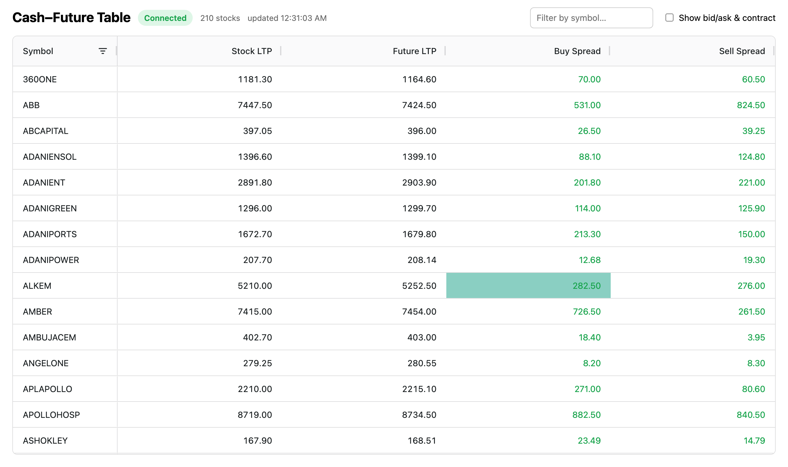

# nse-cash-future-table

Real-time NSE cash–future spread table. A Node.js/WebSocket backend replays
recorded NSE tick data, PostgreSQL stores contract reference data, and a
React + AG Grid frontend renders live cash/future prices and spreads — one
row per stock, updating once per second.



Each row shows, per stock: Symbol, Stock LTP (cash leg), Future LTP
(nearest FUTSTK expiry), Buy Spread (`Future Bid − Stock Ask`), and Sell
Spread (`Stock Bid − Future Ask`). Toggling **Show bid/ask & contract**
reveals the full bid/ask the backend streams for both legs, plus which
future contract was selected for that stock and its expiry.

## Quick start

```
npm run install:all     # installs root + backend + frontend deps
npm run db:up           # starts Postgres in Docker
cp backend/.env.example backend/.env   # then set DATA_DIR (see below)
npm run setup           # migrate + ingest both contract files
npm run dev             # starts backend and frontend together
```

Then open `http://localhost:5173`.

`DATA_DIR` must be the absolute path to the folder holding the 4 NSE CSV
files (`nse_cm_ref_contract_master.csv`, `nse_fo_ref_contract_master.csv`,
`nsecm_market_data.csv`, `nsefo_market_data.csv`). They are not committed —
they total ~950MB. The backend fails fast with a clear message naming the
missing file if the path is wrong.

## Step by step

### 1. Start Postgres

```
docker compose up -d
```

Wait for the `cashfuture_postgres` container to report healthy (`docker ps`).

### 2. Configure the backend

```
cd backend
cp .env.example .env
```

Set `DATA_DIR` in `.env`. Every option is documented inline in
`.env.example`.

### 3. Load the database

```
npm run migrate            # creates cm_contracts / fo_contracts
npm run ingest:contracts   # streams both contract CSVs into Postgres
npm run verify:contracts   # counts + RELIANCE's contracts, nearest first
npm run check:universe     # the resolved cash+future stock universe
```

Both are safely re-runnable: the schema drops and recreates its tables, and
inserts use `ON CONFLICT (token) DO NOTHING`.

Expected output: 4433 cash contracts, 647 FUTSTK futures (76,534 non-FUTSTK
rows skipped), and a 210-stock universe.

### 4. Run it

```
npm run dev     # from the repo root — starts both servers
```

Or separately: `npm run dev` inside `backend/` and `frontend/`. The frontend
defaults to `ws://localhost:8080`; override with `VITE_WS_URL` (see
`frontend/.env.example`).

## Tests

```
npm test        # from the repo root, or inside backend/
```

34 unit tests covering the two different file formats, the NSE epoch
conversion, timestamp bucketing, token routing, the spread formulas
(including partial-leg null handling and rounding), and the simulator's
paise conversion and loop-back wrap. They need neither Postgres nor the CSV
files, so they run anywhere.

## How it works

```
contract CSVs ──► ingest ──► PostgreSQL ──┐
                                          ├─► symbol universe (210 stocks)
                                          │   cash token + nearest future token
market data CSVs ──► filter to those ─────┘
                     tokens, bucket by
                     timestamp, replay ──► row state ──► WebSocket ──► AG Grid
                     1 bucket/second       + spreads
```

## Design decisions

- **The two file types have different formats.** Contract files are
  space-delimited; market data files are comma-delimited — despite both
  using a `.csv` extension. Verified against the real files; separate
  parsers, each with the layout documented at the top.
- **NSE epoch offset.** `expiryDate` and market data `timestamp` are
  seconds since 1980-01-01 00:00:00 IST, not the Unix epoch. Adding
  `NSE_EPOCH_OFFSET_SEC` (315513000) converts them to Unix seconds (UTC) —
  which is what makes RELIANCE's September future land on 2026-09-29.
- **Prices are integers in paise.** Divided by 100 at the simulator
  boundary so everything downstream is in rupees.
- **Market data is filtered to the ~420 relevant tokens before anything
  else.** The raw files hold 8.4M and 20.3M rows across 12,454 and 26,255
  tokens, but only the tokens belonging to stocks with both legs matter.
  Filtering first cuts it to ~1.6M rows per file, which fits comfortably in
  memory and makes a full replay tractable.
- **Replay loops rather than preserving real elapsed time.** The sample
  doesn't cover a full session and the two files span different,
  unsynchronized windows (~26h for cash, ~3h for futures). Ticks are grouped
  into per-second buckets; each leg's simulator advances one bucket per
  `TICK_INTERVAL_MS` and wraps back to the start independently when it runs
  out.
- **Spreads are computed server-side.** `Buy Spread = Future Bid − Stock
  Ask`, `Sell Spread = Stock Bid − Future Ask`, recomputed on every tick so
  all clients render identical numbers. A spread stays `null` (shown as
  `—`) until both legs have ticked, rather than rendering `NaN`.
- **The wire payload carries bid/ask/LTP for both legs**, as the brief
  specifies, plus the derived spreads and the resolved future contract.
- **Snapshot-then-delta over WebSocket.** A new client gets every row
  immediately; after that only the symbols that changed in a tick are
  broadcast, and the grid applies them via `applyTransaction` keyed by
  `getRowId`, so a tick updates a handful of cells instead of re-rendering
  210 rows.
- **NSE test instruments are excluded by default.** 18 `…NSETEST` symbols
  have contracts on both legs and so pass the cash+future join, but never
  receive market data — they'd sit at the top of the table permanently
  empty. `EXCLUDE_TEST_SYMBOLS=false` puts them back (universe: 228).
- **Spread magnitudes look wide.** In this recorded sample a token's
  bid/ask can swing much further between ticks than a live order book
  would, so spreads of tens or hundreds of rupees are normal here.

## Project layout

```
backend/src
  config.ts              env loading + validation (fails fast on bad DATA_DIR)
  db/                    pool, schema, migration, symbol universe, token routing
  ingest/                streaming line reader, contract parsers, bulk loader
  market/                tick parsing, filtering, bucketing, replay, row state
  ws/                    WebSocket server, snapshot + delta broadcast
frontend/src
  useMarketData.ts       WebSocket client, reconnect, snapshot vs delta split
  CashFutureTable.tsx    AG Grid setup, columns, transactions
```

## Known limitations

- Replays a recorded sample rather than a live market feed.
- Both files are held in memory after filtering (~3.3M rows); a production
  feed would stream instead of preloading.
- Display only — no order execution, per the brief.
